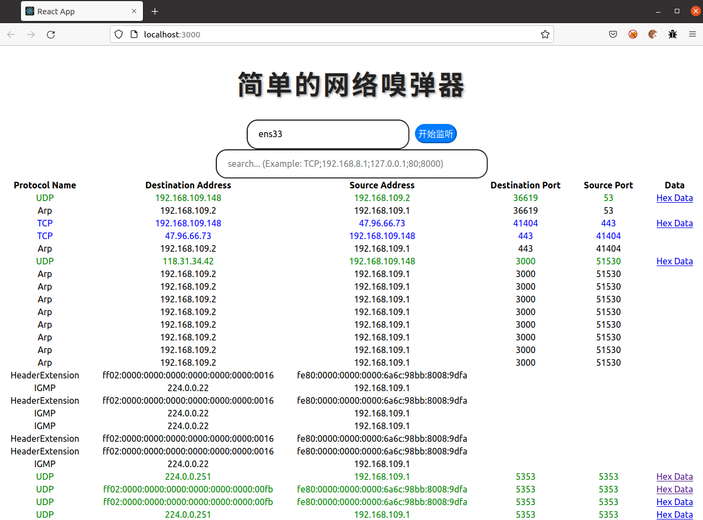
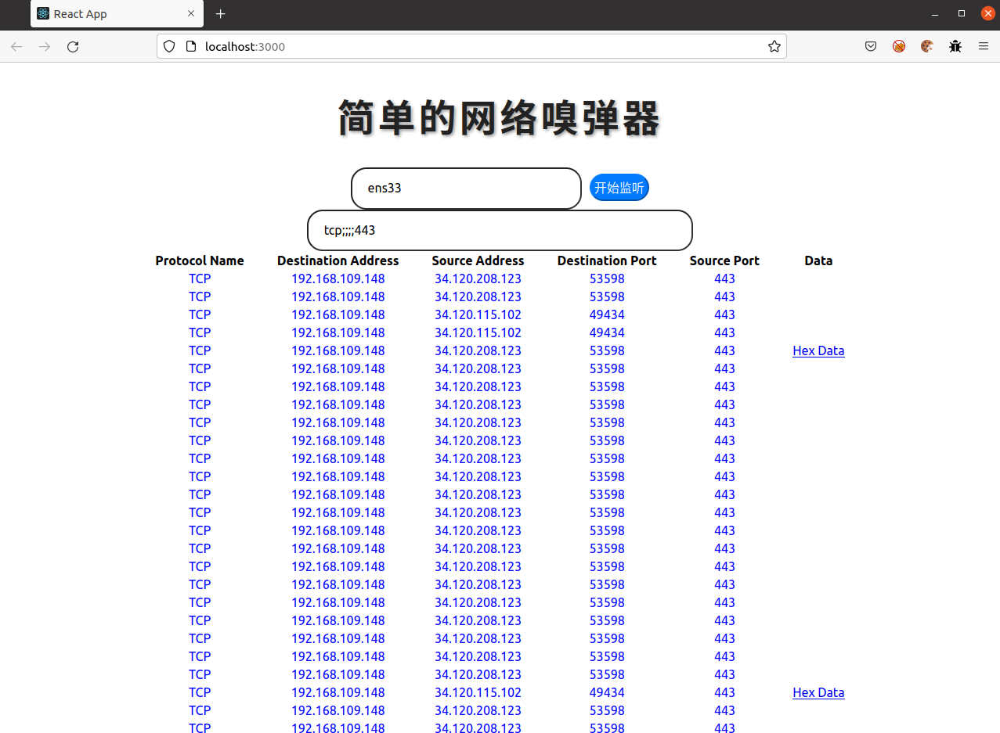

# simpleNetSniffer

该项目是基于react和express、功能简单的网络嗅探器，基本实现NPS功能，有基础的NPA功能。

### 启动

在启动之前，首先需要在本文件夹（也就是这个README所在的文件夹）运行`npm i`以安装依赖项。

#### 启动后端express

在linux环境下，需要先赋予网卡监听权限：`sudo setcap 'cap_net_raw,cap_net_admin+eip' $(readlink -f $(which node))`。

随后进入到`./src/server`文件夹，运行`node app.js`命令即可。

#### 启动前端react

在本文件夹中运行`npm start`命令即可。

### 功能

首先选择你需要监听的网卡，只要点击那个网卡选择框即可发现机器当前可用的所有网卡。

按下“开始监听”按键，开始嗅探网络流量；按下“停止监听”按键，停止嗅探网络流量并显示嗅探到的流量信息。若再次点击“开始监听”，则会继续在原先基础上进行监听。

若需要对监听结果进行过滤，在过滤框中按照相应格式（`Protocol Name;Destination Address;Source Address;Destination Port;Source Port`）输入关键词即可，例如你希望寻找为TCP协议，源端口号为80的包，只需输入`tcp;;;;80`即可。

另外如果对监听到的数据感兴趣，可以点击“Hex Data”，会自动访问相关的用于unhex的网站并看见其解码结果。

